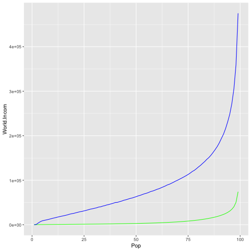

Shiny Application and Reproducible Pitch
========================================================
author: Shadi Seyedi
date: 05/29/2020
autosize: true

About
========================================================

&nbsp;

## 
 This is a presentation for the coursera final course project of Shiny Application and  Reproducible Pitch.

## 
  The goal of this project is to prepare simple Shiny application and provide required information regarding it.

 Application overview 
========================================================

## 
 This application helps you to figure out how rich you are compared to people in the world and USA!

* The data for  US  income distribution is  from 

[US DATA](https://dqydj.com/average-median-top-household-income-percentiles/)

* and data for world income distribution is  from

[World data](https://docs.google.com/spreadsheets/d/1OSiA2dnbvZ5pUti2DO_HJU8phyfCDC-hNz5McTVcEnM/edit#gid=2139097862)

Links to github and app
========================================================
&nbsp;

&nbsp;

* [Github](https://github.com/Shadi-Sadie/Coursera-DataScience/tree/main/Developing%20Data%20Products/Project%202-Week%204/IncomeApp)

* [Application](https://shadis.shinyapps.io/dataprojectApp/)

Slide With Plot
========================================================
## 
 The follwing plot shows the income distribution for quantile population

