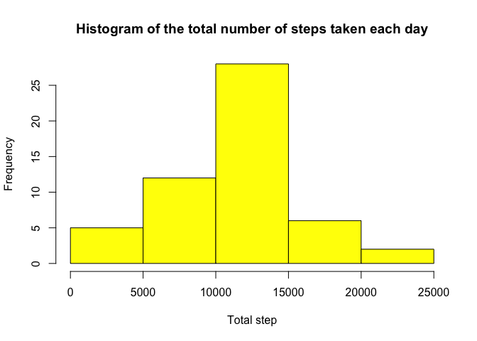
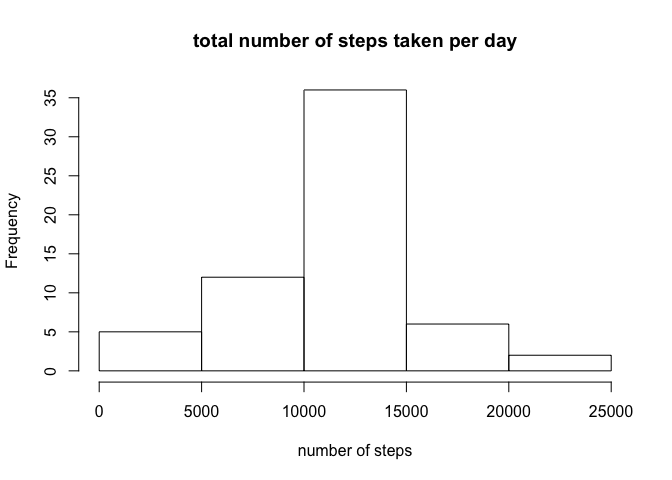

Reproducible Research-Project 1
================
Shadi
1/26/2022

## Loading and preprocessing the data

We start by reading the data and looking at the top row of it to find
out if any intervention is necessary

``` r
activity <-read.csv(file="data/activity.csv")
head(activity)
```

    ##   steps       date interval
    ## 1    NA 2012-10-01        0
    ## 2    NA 2012-10-01        5
    ## 3    NA 2012-10-01       10
    ## 4    NA 2012-10-01       15
    ## 5    NA 2012-10-01       20
    ## 6    NA 2012-10-01       25

``` r
tail(activity)
```

    ##       steps       date interval
    ## 17563    NA 2012-11-30     2330
    ## 17564    NA 2012-11-30     2335
    ## 17565    NA 2012-11-30     2340
    ## 17566    NA 2012-11-30     2345
    ## 17567    NA 2012-11-30     2350
    ## 17568    NA 2012-11-30     2355

We can observe that both 10 rows at the begining and the end of the data
set have NA for steps value to make sure that the this is just not an
error, in our next step we tabulate the values for steps

``` r
head(table(activity$steps))
```

    ## 
    ##     0     1     2     3     4     5 
    ## 11014     7     8     3    25    17

Before moving to the next step we also want to make sure that variable
format are consistent for our analysis.

``` r
str(activity)
```

    ## 'data.frame':    17568 obs. of  3 variables:
    ##  $ steps   : int  NA NA NA NA NA NA NA NA NA NA ...
    ##  $ date    : Factor w/ 61 levels "2012-10-01","2012-10-02",..: 1 1 1 1 1 1 1 1 1 1 ...
    ##  $ interval: int  0 5 10 15 20 25 30 35 40 45 ...

Apparently date here is coded as factor we have to fix date to be
formatted as date.

``` r
activity$date<- as.Date(activity$date)
str(activity$date)
```

    ##  Date[1:17568], format: "2012-10-01" "2012-10-01" "2012-10-01" "2012-10-01" "2012-10-01" ...

Data is now ready for further analysis.

## What is mean total number of steps taken per day?

### Calculation number of step per day

I would like to calculate the total steps in two diffrent way

  - first way

<!-- end list -->

``` r
totalstep<-tapply(activity$steps,activity$date,sum)
head(totalstep)
```

    ## 2012-10-01 2012-10-02 2012-10-03 2012-10-04 2012-10-05 2012-10-06 
    ##         NA        126      11352      12116      13294      15420

The result of this code is an array of numbe while the result of the
second way code is a data frame stepbydate with two variable of date and
total step \* second way

``` r
library(dplyr)
```

    ## 
    ## Attaching package: 'dplyr'

    ## The following objects are masked from 'package:stats':
    ## 
    ##     filter, lag

    ## The following objects are masked from 'package:base':
    ## 
    ##     intersect, setdiff, setequal, union

``` r
Stepbyday<- activity %>% group_by(date) %>% summarise(totalstep=sum(steps))
head(Stepbyday)
```

    ## # A tibble: 6 x 2
    ##   date       totalstep
    ##   <date>         <int>
    ## 1 2012-10-01        NA
    ## 2 2012-10-02       126
    ## 3 2012-10-03     11352
    ## 4 2012-10-04     12116
    ## 5 2012-10-05     13294
    ## 6 2012-10-06     15420

1.Histogram of the total number of steps taken each
day

``` r
hist(Stepbyday$totalstep,main="Histogram of the total number of steps taken each day", xlab="Total step", col = "Yellow")
```

<!-- -->

2.Mean and median total number of steps taken per day

``` r
mean(totalstep,na.rm=TRUE)
```

    ## [1] 10766.19

``` r
median(totalstep,na.rm=TRUE)
```

    ## [1] 10765

## What is the average daily activity pattern?

1.Make a time series plot (i.e. type = “l”) of the 5-minute interval
(x-axis) and the average number of steps taken, averaged across all days
(y-axis)

### Creating the data frame needed for plot time-series

1.  find average number of step per day for y-axis of
plot

<!-- end list -->

``` r
avgstep<- activity %>% group_by(interval) %>% na.omit()  %>% summarise(totalstep=mean(steps))
head(avgstep)
```

    ## # A tibble: 6 x 2
    ##   interval totalstep
    ##      <int>     <dbl>
    ## 1        0    1.72  
    ## 2        5    0.340 
    ## 3       10    0.132 
    ## 4       15    0.151 
    ## 5       20    0.0755
    ## 6       25    2.09

2.  create a time series
graph

<!-- end list -->

``` r
with(avgstep,plot(interval,totalstep,type = "l",  main = "The average daily activity pattern"))
```

<!-- -->

2.  Which 5-minute interval, on average across all the days in the
    dataset, contains the maximum number of steps?

<!-- end list -->

``` r
avgstep[which.max(avgstep$totalstep),]
```

    ## # A tibble: 1 x 2
    ##   interval totalstep
    ##      <int>     <dbl>
    ## 1      835      206.

## Imputing missing values

1.  Calculate and report the total number of missing values

<!-- end list -->

``` r
sum(is.na(activity$steps))
```

    ## [1] 2304

2.  Devise a strategy for filling in all of the missing values in the
    datase

As a strategy I will replace NA with the average of steps of the day

``` r
meansteps=mean(activity$step,na.rm=TRUE)
```

3.  Create a new dataset that is equal to the original dataset but with
    the missing data filled in.

To prevent any problem I will create a copy of activity data set and
impute NA on that one

``` r
stepdata<-activity

stepdata$steps<-replace(stepdata$steps, is.na(stepdata$steps), meansteps)
```

checkin if the new dataset have missing values

``` r
sum(is.na(stepdata$steps))
```

    ## [1] 0

4.  Calculate Histogram,mean,median total number of step per day for new
    data.frame

<!-- end list -->

``` r
library(ggplot2)
newtotalstep<-tapply(stepdata$steps,stepdata$date,sum)

newtotalstep<- stepdata %>% group_by(date) %>% summarise(totalstep=sum(steps))

hist(newtotalstep$totalstep, xlab = "number of steps",
      main = "total number of steps taken per day")
```

<!-- -->

The new mean and median are as follow

``` r
mean(newtotalstep$totalstep,na.rm=TRUE)
```

    ## [1] 10766.19

``` r
median(newtotalstep$totalstep,na.rm=TRUE)
```

    ## [1] 10766.19

Next, we caclute the diffrence between the new and old mean and
median

``` r
meandif<- mean(totalstep,na.rm=TRUE)-mean(newtotalstep$totalstep,na.rm=TRUE)
meddif<-median(totalstep,na.rm=TRUE)-median(newtotalstep$totalstep,na.rm=TRUE)

print("diffrence in mean is", meandif)
```

    ## [1] "diffrence in mean is"

#### As we can see the mean is the same as when we didn’t substitue the NA variable,

#### but the median has slightly changed. our new median is equall to are mean.

## Are there differences in activity patterns between weekdays and weekends?

1.  Create new variable in the new data set with filled in missing
    value.

{r, echo=TRUE} week\<-weekdays(as.POSIXlt(activity$date)) week\<-ifelse
((week ==“Sunday” | week ==“Saturday”) ,“weekend”, “weekday”)
newactivity\<-data.frame(cbind(newactivity,week))

2.  Make a panel plot containing a time series plot

<!-- end list -->

1.  build the new variable avrage step per day

{r, echo=TRUE}
avgsteptaken\<-tapply(newactivity\(steps,newactivity\)interval,mean,na.rm=TRUE)
newactivity\<-data.frame(cbind(avgsteptaken, newactivity)) \`

2.  two time series graph for weekday no weekend

{r, echo=TRUE}

png(“Plots/plot3.png”, width=600, height=600)

par(mfrow=c(2,1))
plot(newactivity\(interval, subset(newactivity,week="weekdat")\)avgsteptaken,type
= “l”)
plot(newactivity\(interval, subset(newactivity,week="weekend")\)avgsteptaken,type
= “l”)
