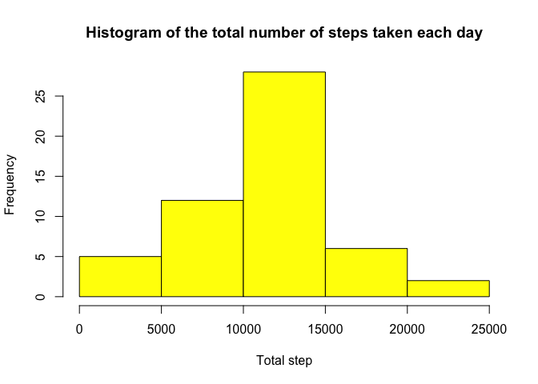
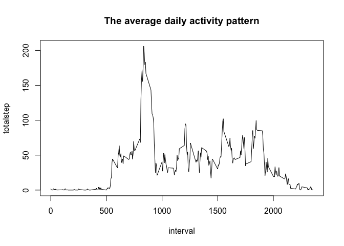
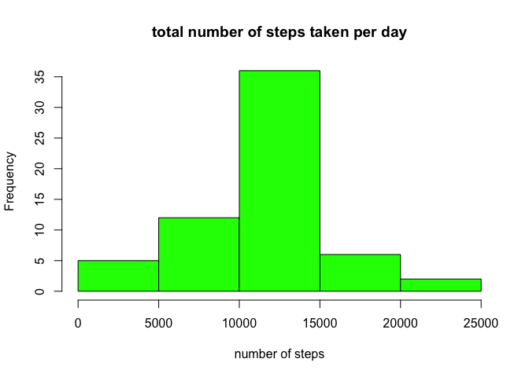
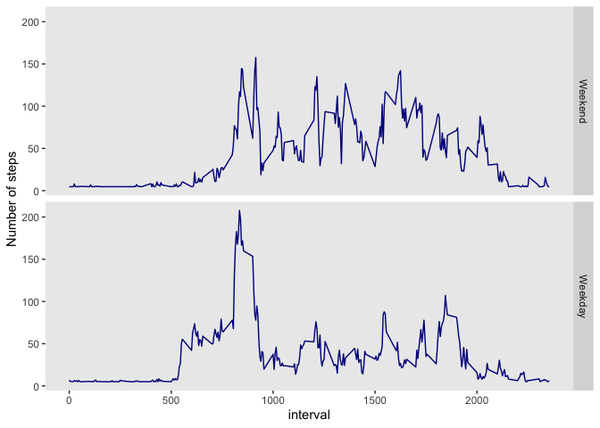

Reproducible Research-Project 1
================
Shadi
1/26/2022

## Loading necessary libraries

``` r
library(dplyr)
```

    ## 
    ## Attaching package: 'dplyr'

    ## The following objects are masked from 'package:stats':
    ## 
    ##     filter, lag

    ## The following objects are masked from 'package:base':
    ## 
    ##     intersect, setdiff, setequal, union

``` r
library(ggplot2)
```

## Loading and preprocessing the data

We start by reading the data and looking at the top row of it to find
out if any intervention is necessary

``` r
activity <-read.csv(file="data/activity.csv")
head(activity)
```

    ##   steps       date interval
    ## 1    NA 2012-10-01        0
    ## 2    NA 2012-10-01        5
    ## 3    NA 2012-10-01       10
    ## 4    NA 2012-10-01       15
    ## 5    NA 2012-10-01       20
    ## 6    NA 2012-10-01       25

``` r
tail(activity)
```

    ##       steps       date interval
    ## 17563    NA 2012-11-30     2330
    ## 17564    NA 2012-11-30     2335
    ## 17565    NA 2012-11-30     2340
    ## 17566    NA 2012-11-30     2345
    ## 17567    NA 2012-11-30     2350
    ## 17568    NA 2012-11-30     2355

We can observe that both 10 rows at the begining and the end of the data
set have NA for steps value to make sure that the this is just not an
error, in our next step we tabulate the values for steps

``` r
head(table(activity$steps))
```

    ## 
    ##     0     1     2     3     4     5 
    ## 11014     7     8     3    25    17

Before moving to the next step we also want to make sure that variable
format are consistent for our analysis.

``` r
str(activity)
```

    ## 'data.frame':    17568 obs. of  3 variables:
    ##  $ steps   : int  NA NA NA NA NA NA NA NA NA NA ...
    ##  $ date    : Factor w/ 61 levels "2012-10-01","2012-10-02",..: 1 1 1 1 1 1 1 1 1 1 ...
    ##  $ interval: int  0 5 10 15 20 25 30 35 40 45 ...

Apparently date here is coded as factor we have to fix date to be
formatted as date.

``` r
activity$date<- as.Date(activity$date)
str(activity$date)
```

    ##  Date[1:17568], format: "2012-10-01" "2012-10-01" "2012-10-01" "2012-10-01" "2012-10-01" ...

Data is now ready for further analysis.

## What is mean total number of steps taken per day?

### 1\. Making a Histogram of the total number of steps taken each day

I would like to start by calculating the total steps in two diffrent way

  - first way

<!-- end list -->

``` r
totalstep<-tapply(activity$steps,activity$date,sum)
head(totalstep)
```

    ## 2012-10-01 2012-10-02 2012-10-03 2012-10-04 2012-10-05 2012-10-06 
    ##         NA        126      11352      12116      13294      15420

The result of this code is an array of numbe while the result of the
second way code is a data frame stepbydate with two variable of date and
total step

  - second way

<!-- end list -->

``` r
library(dplyr)
Stepbyday<- activity %>% group_by(date) %>% summarise(totalstep=sum(steps))
head(Stepbyday)
```

    ## # A tibble: 6 x 2
    ##   date       totalstep
    ##   <date>         <int>
    ## 1 2012-10-01        NA
    ## 2 2012-10-02       126
    ## 3 2012-10-03     11352
    ## 4 2012-10-04     12116
    ## 5 2012-10-05     13294
    ## 6 2012-10-06     15420

Then using the caluclated total step I create the histogram
plot

``` r
hist(Stepbyday$totalstep,main="Histogram of the total number of steps taken each day", xlab="Total step", col = "Yellow")
```

<!-- -->

### 2\. Mean and median total number of steps taken per day

``` r
mean(totalstep,na.rm=TRUE)
```

    ## [1] 10766.19

``` r
median(totalstep,na.rm=TRUE)
```

    ## [1] 10765

## What is the average daily activity pattern?

### 1\. Makeing a time series plot (i.e. type = “l”) of the 5-minute interval (x-axis) and the average number of steps taken, averaged across all days (y-axis)

first we start by finding average number of step per day for y-axis of
plot

``` r
avgstep<- activity %>% group_by(interval) %>% na.omit()  %>% summarise(totalstep=mean(steps))
head(avgstep)
```

    ## # A tibble: 6 x 2
    ##   interval totalstep
    ##      <int>     <dbl>
    ## 1        0    1.72  
    ## 2        5    0.340 
    ## 3       10    0.132 
    ## 4       15    0.151 
    ## 5       20    0.0755
    ## 6       25    2.09

then we create a time series
graph

``` r
with(avgstep,plot(interval,totalstep,type = "l",  main = "The average daily activity pattern"))
```

<!-- -->

### 2\. Which 5-minute interval, on average across all the days in the dataset, contains the maximum number of steps?

The result is as follows

``` r
avgstep[which.max(avgstep$totalstep),]
```

    ## # A tibble: 1 x 2
    ##   interval totalstep
    ##      <int>     <dbl>
    ## 1      835      206.

Interval 835 has the maximum number of steps which equals to 206

## Imputing missing values

### 1\. Calculateion and reporting of the total number of missing values

``` r
sum(is.na(activity$steps))
```

    ## [1] 2304

\#\#\# 2. Deviseing a strategy for filling in all of the missing values
in the datase

My strategy here is to replace NA with the average of steps , to do so I
will create a meansteps which contains the avergae value of
steps.

``` r
meansteps=mean(activity$step,na.rm=TRUE)
```

### 3\. Create a new dataset that is equal to the original dataset but with the missing data filled in.

To prevent any future problem and to compare the diffrence between
imputed and not impluted dataset I will create a copy of activity data
set and will call it stepdata. Afterward, I will continue by replacing
the missing values with the average step value, calculated in previous
chunck.

``` r
stepdata<-activity

stepdata$steps<-replace(stepdata$steps, is.na(stepdata$steps), meansteps)
```

Finally, I check if the new dataset have missing values

``` r
sum(is.na(stepdata$steps))
```

    ## [1] 0

Taaa Daaa everything is good

\#\#\# 4. Calculate Histogram,mean,median total number of step per day
for new data.frame

1)  Histogram of the new data

<!-- end list -->

``` r
newtotalstep<-tapply(stepdata$steps,stepdata$date,sum)

newtotalstep<- stepdata %>% group_by(date) %>% summarise(totalstep=sum(steps))


hist(newtotalstep$totalstep, xlab = "number of steps",
      main = "total number of steps taken per day", col="green")
```

<!-- -->

2)  new mean and median are as follow

<!-- end list -->

``` r
mean(newtotalstep$totalstep,na.rm=TRUE)
```

    ## [1] 10766.19

``` r
median(newtotalstep$totalstep,na.rm=TRUE)
```

    ## [1] 10766.19

3)  diffrence between the new and old mean and
median

<!-- end list -->

``` r
meandif<- mean(totalstep,na.rm=TRUE)-mean(newtotalstep$totalstep,na.rm=TRUE)
meddif<-median(totalstep,na.rm=TRUE)-median(newtotalstep$totalstep,na.rm=TRUE)

paste("diffrence in mean is", meandif)
```

    ## [1] "diffrence in mean is 0"

``` r
paste("diffrence in median is", meddif)
```

    ## [1] "diffrence in median is -1.1886792452824"

As we can see the mean is the same as when we didn’t substitue the NA
variable,but the median has slightly changed. our new median is equall
to are
mean.

## Are there differences in activity patterns between weekdays and weekends?

### 1\. Create a new factor variable in the dataset with two levels – “weekday” and “weekend” indicating whether a given date is a weekday or weekend day.

Usin g the weekday function I will frist create a new charachter
variable weekday which containt the weekday name. Then using this
weekday variable I will create a factor variable called day indicator
which indicate wether that day is weekend or weekday

``` r
stepdata$weekday<-weekdays(stepdata$date)
stepdata$dayindicator<-ifelse(stepdata$weekday %in% c("Sunday","Saturday"),0,1)
stepdata$dayindicator<- ordered(stepdata$dayindicator,
                          levels = c(0,1),
                          labels = c("Weekend","Weekday"))

head(stepdata,3)
```

    ##     steps       date interval weekday dayindicator
    ## 1 37.3826 2012-10-01        0  Monday      Weekday
    ## 2 37.3826 2012-10-01        5  Monday      Weekday
    ## 3 37.3826 2012-10-01       10  Monday      Weekday

### 2\. Make a panel plot containing a time series plot

1.  build the new variable avrage step per
day

<!-- end list -->

``` r
panelstepdata<- stepdata %>% group_by(interval,dayindicator) %>% summarise(tSteps=mean(steps))
```

    ## `summarise()` has grouped output by 'interval'. You can override using the `.groups` argument.

``` r
head(panelstepdata,3)
```

    ## # A tibble: 3 x 3
    ## # Groups:   interval [2]
    ##   interval dayindicator tSteps
    ##      <int> <ord>         <dbl>
    ## 1        0 Weekend        4.67
    ## 2        0 Weekday        7.01
    ## 3        5 Weekend        4.67

two time series graph for weekday no weekend

``` r
g<- ggplot(panelstepdata, aes(interval,tSteps,panelstepdata))
g+geom_line(col= "darkblue")+facet_grid(dayindicator~.)+labs(y= "Number of steps")+
theme(panel.grid.major = element_blank(),panel.grid.minor = element_blank())
```

<!-- -->
